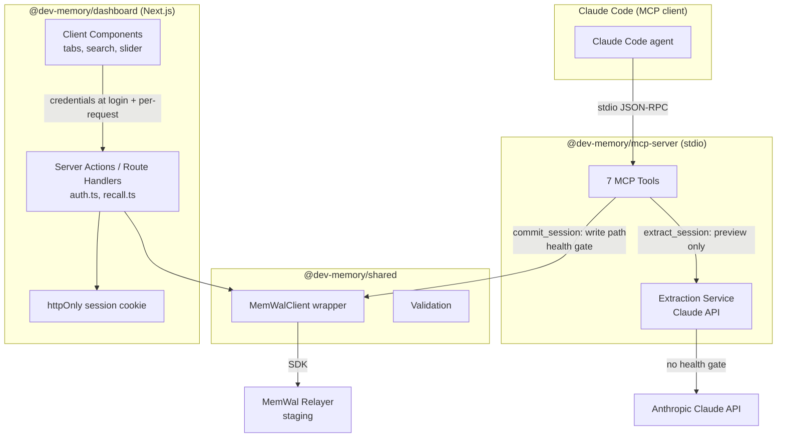
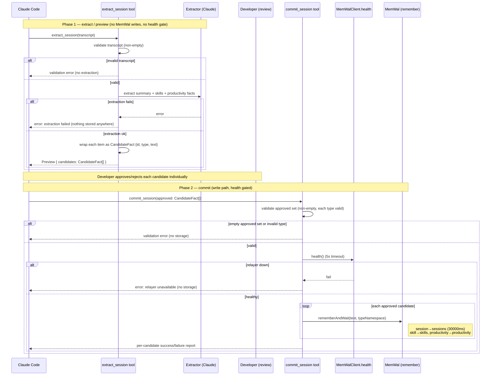
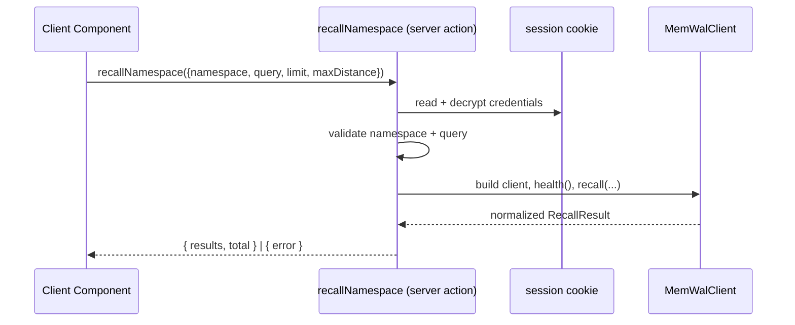

# Design Document

## Overview

DevMemory turns Claude Code coding sessions into verified, searchable memories stored on Walrus Memory (MemWal). It has two deliverables that share a common MemWal client layer:

1. **MCP Server** — a TypeScript Model Context Protocol server (stdio transport) that Claude Code connects to. It exposes seven tools that capture sessions through a two-phase capture-with-review flow, recall memories, generate aggregated reports, and produce sharing credentials.
2. **Next.js Dashboard** — an App Router + Tailwind web app for browsing the four memory namespaces (sessions, skills, productivity, reports), searching them semantically, filtering by relevance, and presenting role-scoped views for developers, team leads, and recruiters.

Both deliverables build on the MemWal SDK (`@mysten-incubation/memwal`), which provides append-only semantic memory scoped by `owner + namespace`. The MCP server owns the *write* path, but writes now happen **only at commit**. The dashboard is read-only and only ever *recalls*.

### Two-phase session capture

Session capture is split into two stateless MCP tools so the developer reviews every Candidate_Fact before anything is stored:

1. **`extract_session` (preview phase)** — validates the transcript, calls the Claude API to derive a candidate session summary, candidate skill facts, and candidate productivity metrics, assigns each Candidate_Fact a stable identifier and a type (`session` / `skill` / `productivity`), and **returns a Preview without storing anything in any namespace**. Because extraction writes nothing to MemWal, it does **not** require the relayer health gate — it depends only on the Claude API.
2. **`commit_session` (commit phase)** — receives the approved Candidate_Facts (each with `id`, `type`, `text` from the Preview) and stores each into the namespace matching its type (`session` → `sessions` with a 30000ms timeout, `skill` → `skills`, `productivity` → `productivity`) via `rememberAndWait`. This is the only place writes occur, so the **relayer health gate applies here**. Partial approval is supported, each fact's outcome is reported individually, and a single fact's failure does not abort the remaining writes.

The handoff is **stateless**: `extract_session` returns the candidates to the caller; the developer passes the approved candidates back to `commit_session`. There is no server-side staging store between the two phases.

### Key design principles

- **Delegate keys never leave the server boundary.** The MemWal delegate private key is treated as a server-only secret in both deliverables. The MCP server reads it from environment; the dashboard accepts it at login but only ever uses it inside server actions / route handlers, never in client components.
- **Single shared MemWal wrapper.** A thin wrapper (`MemWalClient`) centralizes client construction, the mandatory pre-operation health check, namespace validation, and result normalization so both deliverables behave identically.
- **Append-only semantics.** Every store is a `rememberAndWait` append. DevMemory never attempts upserts or deletes, matching MemWal's model.
- **Nothing enters MemWal unreviewed.** Extraction produces only candidates; storage happens at commit, and only for the approved subset.
- **Fail soft on multi-fact storage.** Committing a session performs many independent writes; partial failure is reported per-fact rather than aborting the whole operation.

### Research notes informing the design

- **MemWal SDK surface** (from the SDK documentation): `MemWal.create({ key, accountId, serverUrl, namespace })`; instance methods `rememberAndWait(text, namespace?, opts?)`, `recall({ query, limit?, namespace?, maxDistance? })`, `analyzeAndWait(text, namespace?, opts?)`, `health()`, `getPublicKeyHex()`. `recall` returns `{ results: [{ blob_id, text, distance }], total }`. Distance bands: `< 0.25` duplicate, `0.25–0.55` related, `0.55–0.7` weak, `>= 0.7` unrelated.
- **Namespace semantics**: an opaque flat string scoped to `owner + namespace`; `remember` always appends; isolation is guaranteed across owners and namespaces. This means DevMemory does not need to manage isolation itself — it only needs to pick the correct namespace string per operation.
- **Credential security in Next.js**: delegate private keys are server-only. The recommended pattern is to keep `"use server"` files exporting only async functions and to construct MemWal clients inside server-only modules that read credentials per request. This drives the dashboard's "credentials in httpOnly session cookie, MemWal client built per request server-side" decision documented in the Architecture section.
- **Claude API**: fact extraction and report summarization use `@anthropic-ai/sdk` with model `claude-sonnet-4-20250514`. Extraction returns structured JSON we parse into discrete facts; summarization returns prose. `extract_session` wraps each extracted item (the session summary, every skill fact, every productivity metric) as a `CandidateFact` carrying a stable id and a type label before returning the Preview.

## Architecture

### Monorepo structure

DevMemory is a monorepo with two publishable/runnable packages plus a shared library, managed with npm/pnpm workspaces.

```
dev-memory/
├── package.json                  # workspace root (workspaces: packages/*)
├── tsconfig.base.json
├── packages/
│   ├── shared/                   # @dev-memory/shared — shared types + MemWal wrapper + validation
│   │   ├── src/
│   │   │   ├── memwal-client.ts   # MemWalClient wrapper (health check, recall, remember)
│   │   │   ├── validation.ts      # namespace/query/hex/accountId validators
│   │   │   ├── namespaces.ts       # Namespace constants + role→namespace map
│   │   │   ├── result.ts           # normalizeRecall, RecallResult types
│   │   │   └── index.ts
│   │   └── package.json
│   ├── mcp-server/               # @dev-memory/mcp-server — Claude Code MCP server (stdio)
│   │   ├── src/
│   │   │   ├── index.ts            # server bootstrap, startup health check, tool registration
│   │   │   ├── tools/
│   │   │   │   ├── extract-session.ts
│   │   │   │   ├── commit-session.ts
│   │   │   │   ├── recall-memory.ts
│   │   │   │   ├── my-skills.ts
│   │   │   │   ├── my-productivity.ts
│   │   │   │   ├── generate-report.ts
│   │   │   │   └── generate-share-info.ts
│   │   │   ├── extraction/
│   │   │   │   ├── extractor.ts     # Claude API fact extraction + report summarization
│   │   │   │   └── prompts.ts
│   │   │   └── config.ts           # env loading (DELEGATE_KEY, ACCOUNT_ID, RELAYER_URL, ANTHROPIC_API_KEY)
│   │   └── package.json
│   └── dashboard/                # @dev-memory/dashboard — Next.js App Router app
│       ├── src/
│       │   ├── app/
│       │   │   ├── login/page.tsx
│       │   │   ├── (dashboard)/layout.tsx
│       │   │   ├── (dashboard)/skills/page.tsx
│       │   │   ├── (dashboard)/productivity/page.tsx
│       │   │   ├── (dashboard)/sessions/page.tsx
│       │   │   ├── (dashboard)/reports/page.tsx
│       │   │   └── actions/
│       │   │       ├── auth.ts          # "use server" — login (health check), logout
│       │   │       └── recall.ts        # "use server" — recallNamespace proxy
│       │   ├── server/
│       │   │   ├── session.ts           # httpOnly cookie read/write, server-only
│       │   │   └── memwal-factory.ts    # builds MemWalClient per request from session
│       │   ├── components/
│       │   │   ├── TabBar.tsx
│       │   │   ├── SearchBox.tsx
│       │   │   ├── DistanceSlider.tsx
│       │   │   ├── SkillCard.tsx
│       │   │   ├── ProductivityCard.tsx
│       │   │   ├── SessionBlock.tsx
│       │   │   └── ReportBlock.tsx
│       │   └── lib/
│       │       └── roles.ts             # client-safe role→tabs logic (re-exports shared)
│       └── package.json
```

### High-level component diagram



### Credential flow decision (dashboard)

**Decision: store credentials in an encrypted, httpOnly, SameSite=Strict session cookie set at login; rebuild a MemWal client server-side on every request from that cookie. Credentials are never exposed to client JavaScript and never persisted in a database.**

Rationale and alternatives considered:

- **Why not keep the delegate key in client storage (localStorage/sessionStorage) and POST it with each recall?** The SDK documentation is explicit that delegate private keys are server-only. Putting the key in client-readable storage exposes it to any XSS on the page and to browser extensions, and forces it across the network on every request body. Rejected.
- **Why not persist credentials in a database keyed by a session?** The delegate key is a bearer secret for someone else's account (sharing use case). Persisting it server-side creates a long-lived secret store and a breach blast radius with no functional benefit, since each viewer session is ephemeral. Rejected.
- **Chosen approach — httpOnly session cookie:** At login the credentials are submitted to the `login` server action. The action runs MemWal `health()` to validate them, and on success serializes `{ accountId, delegateKey, role }` into an **encrypted** payload (AES-GCM using a server-side `SESSION_SECRET`) stored in an `httpOnly`, `Secure`, `SameSite=Strict` cookie. Client JavaScript cannot read it. Every server action (`recallNamespace`) reads the cookie, decrypts it, constructs a `MemWalClient` for the duration of the request, performs the recall, and discards the client. The delegate key never reaches the browser after login and is never written to durable storage. Logout clears the cookie.

This keeps `"use server"` files exporting only async functions, with the MemWal client construction isolated in `server/memwal-factory.ts` (a server-only module, guarded with `import "server-only"`).

### Request lifecycles

**Two-phase session capture (MCP):**

The two tools are independent calls; the developer reviews the Preview between them. Extraction never touches MemWal (no health gate); commit is the sole write path (health gated).



**Dashboard recall:**



## Components and Interfaces

### Shared: MemWalClient wrapper (`packages/shared/src/memwal-client.ts`)

Centralizes construction, the mandatory health check, and result normalization. Used identically by the MCP server and dashboard server actions.

```typescript
export interface MemWalCredentials {
  key: string;        // 64-char hex Ed25519 delegate private key
  accountId: string;  // 0x-prefixed 64-char hex Sui account object id
  serverUrl: string;  // relayer URL
  namespace: string;  // default namespace
}

export interface RecallParams {
  query: string;
  namespace: Namespace;
  limit?: number;      // clamped to [1, 100], default 10
  maxDistance?: number; // clamped to [0, 1], default 0.7
}

export interface RecallEntry { blob_id: string; text: string; distance: number; }
export interface RecallResult { results: RecallEntry[]; total: number; }

export class MemWalClient {
  static fromCredentials(creds: MemWalCredentials): MemWalClient;

  /** health() with timeout; resolves true only when status === "ok". */
  isHealthy(timeoutMs?: number): Promise<boolean>;

  /** Validates namespace + query, clamps limit/maxDistance, calls recall, normalizes output. */
  recall(params: RecallParams): Promise<RecallResult>;

  /** rememberAndWait append. */
  remember(text: string, namespace: Namespace, timeoutMs?: number): Promise<StoredRef>;

  getPublicKeyHex(): string;
}
```

### Shared: validation (`packages/shared/src/validation.ts`)

Pure functions, no I/O — the primary target for property-based testing.

```typescript
export const NAMESPACES = ["sessions", "skills", "productivity", "reports"] as const;
export type Namespace = (typeof NAMESPACES)[number];

export function isValidNamespace(value: string): value is Namespace;

/** A query is valid iff it has at least one non-whitespace character. */
export function isValidQuery(value: string | undefined | null): boolean;

/** Transcript valid iff present and not whitespace-only. */
export function isValidTranscript(value: string | undefined | null): boolean;

/** 64-char lowercase/uppercase hex, no prefix. */
export function isValidDelegateKey(value: string): boolean;

/** 0x-prefixed 64-char hex. */
export function isValidAccountId(value: string): boolean;

/** Clamp limit to [1,100]; undefined → 10. */
export function clampLimit(limit?: number): number;

/** Clamp maxDistance to [0,1]; undefined → 0.7. */
export function clampMaxDistance(maxDistance?: number): number;
```

### Shared: roles (`packages/shared/src/namespaces.ts`)

```typescript
export type Role = "developer" | "team-lead" | "recruiter";
export type Tab = "skills" | "productivity" | "sessions" | "reports";

/** Tabs visible for a role, in display order. */
export function tabsForRole(role: Role): Tab[];
// developer  → [skills, productivity, sessions, reports]
// team-lead  → [productivity, reports]
// recruiter  → [skills]

/** First visible tab for a role (used when active tab becomes hidden). */
export function defaultTabForRole(role: Role): Tab;
```

### MCP Server: tools

Most tools share a guard sequence: per-tool `isHealthy()` check (5s) → input validation → operation. The exception is `extract_session`, which performs **no** health check because it never writes to MemWal — it only validates input and calls the Claude API. Each tool returns MCP tool content (text). Tool input schemas are defined with the MCP SDK's JSON Schema.

| Tool | Input | Behavior |
|------|-------|----------|
| `extract_session` | `{ transcript: string }` | **No health gate.** Validate transcript; call Claude to derive a candidate session summary + skill facts + productivity metrics; wrap each as a `CandidateFact` with a stable `id` and `type` (`session`/`skill`/`productivity`); return a `Preview`. Stores nothing in any namespace. |
| `commit_session` | `{ approved: CandidateFact[] }` | Health gated. Validate the approved set (non-empty; each `type` valid); store each approved candidate via `rememberAndWait` into the namespace matching its type (`session`→`sessions` at 30000ms, `skill`→`skills`, `productivity`→`productivity`); continue past per-fact failures; return a per-candidate success/failure report. |
| `recall_memory` | `{ query: string, namespace: Namespace, limit?: number, maxDistance?: number }` | Validate namespace + query; recall; return `{blob_id, text, distance}[]` + total. |
| `my_skills` | `{ query?: string }` | Recall `skills` with query or default `"skills and technologies"`, limit 10. |
| `my_productivity` | `{ query?: string }` | Recall `productivity` with query or default `"productivity and output"`, limit 10. |
| `generate_report` | `{}` | Recall ≤50 from `skills` + ≤50 from `productivity`; if combined <3 → not-enough-data; else summarize via Claude; store in `reports`; return summary. |
| `generate_share_info` | `{}` | Return `getPublicKeyHex()`, accountId, relayer URL + instructions; never the private key; error if no delegate key. |

### MCP Server: extraction service (`extraction/extractor.ts`)

```typescript
export interface ExtractedFacts {
  skills: string[];        // discrete skill fact strings
  productivity: string[];  // discrete productivity metric strings
}

export interface Extractor {
  /** Calls Claude (claude-sonnet-4-20250514) and parses structured JSON into facts. */
  extractFacts(transcript: string): Promise<ExtractedFacts>;

  /** Aggregates recalled entries into a prose report. */
  summarizeReport(skills: string[], productivity: string[]): Promise<string>;
}
```

The extractor uses a strict JSON-output prompt and parses the response defensively (see Error Handling). Parsing tolerates surrounding prose/markdown fences and extracts the JSON object.

`extract_session` consumes `ExtractedFacts` plus the derived session summary and wraps every item as a `CandidateFact` (see Data Models): the summary becomes a `session`-type candidate, each `skills[]` entry a `skill`-type candidate, and each `productivity[]` entry a `productivity`-type candidate. Each candidate receives a stable, unique `id` so the developer can approve/reject individually and pass the approved candidates back to `commit_session`.

### MCP Server: candidate facts and commit result

`extract_session` produces a `Preview` of `CandidateFact`s; `commit_session` consumes the approved subset and reports a per-candidate outcome.

```typescript
export type CandidateType = "session" | "skill" | "productivity";

export interface CandidateFact {
  id: string;            // stable, unique identifier assigned at extraction
  type: CandidateType;   // routes to sessions | skills | productivity at commit
  text: string;          // the candidate summary / skill fact / productivity metric
}

export interface Preview {
  candidates: CandidateFact[];  // returned by extract_session; nothing stored yet
}

export interface CommitFactOutcome {
  id: string;            // echoes the approved candidate's id
  type: CandidateType;
  namespace: Namespace;  // namespace the candidate was routed to
  ok: boolean;
  error?: string;
}

export interface CommitSessionResult {
  outcomes: CommitFactOutcome[];  // one per approved candidate, in input order
  succeeded: number;
  failed: number;
}
```

`commit_session` maps each approved candidate's `type` to its namespace (`session`→`sessions`, `skill`→`skills`, `productivity`→`productivity`), attempts every write independently, and aggregates the outcomes so `succeeded + failed` equals the number of approved candidates.

### Dashboard: server actions

```typescript
// app/actions/auth.ts  ("use server")
export async function login(input: {
  delegateKey: string; accountId: string; role: Role;
}): Promise<{ ok: true } | { ok: false; kind: "invalid-credentials" | "connectivity"; message: string }>;
export async function logout(): Promise<void>;

// app/actions/recall.ts  ("use server")
export async function recallNamespace(input: {
  namespace: Namespace; query: string; limit?: number; maxDistance?: number;
}): Promise<{ ok: true; results: RecallEntry[]; total: number } | { ok: false; message: string }>;
```

`login` distinguishes invalid-credentials (health responded but auth failed) from connectivity (network error / 10s timeout), satisfying Requirement 7.2 vs 7.5.

### Dashboard: UI components

- **TabBar** — renders only `tabsForRole(role)`; switching role re-derives tabs without reload and redirects to `defaultTabForRole` when the active tab is hidden (Req 13.5).
- **SearchBox** — submits on Enter or button; triggers `recallNamespace`.
- **DistanceSlider** — range 0.0–1.0, step 0.01, default 0.7; 300ms debounce; displays value to 2 decimals (Req 12).
- **SkillCard / ProductivityCard** — show fact text prominently + distance score as secondary numeric.
- **SessionBlock** — truncates to 300 chars with expand control (Req 10.1–10.2).
- **ReportBlock** — full text with paragraph formatting (Req 11.1).

Each tab page is a client component holding `{query, limit, maxDistance, results, loading, error}` state; on mount it issues the broad default query; it keeps previous results on error (Reqs 8.4, 9.3, 12.4).

## Data Models

### Namespace entry shapes (stored text)

MemWal stores opaque text per entry. DevMemory standardizes the text payload per namespace so recall + display are predictable.

| Namespace | Stored text content | Producer |
|-----------|--------------------|----------|
| `sessions` | A concise session summary derived from the transcript (raw summary). | `commit_session` (approved `session` candidate) |
| `skills` | One discrete skill fact per entry, e.g. `"Implemented JWT auth middleware in Express (TypeScript)"`. | `commit_session` (approved `skill` candidates) |
| `productivity` | One discrete productivity metric per entry, e.g. `"Closed 3 PRs and resolved 5 review comments in one session"`. | `commit_session` (approved `productivity` candidates) |
| `reports` | Full prose report text covering skill highlights + productivity patterns. | `generate_report` |

The candidate text for `sessions`, `skills`, and `productivity` originates from `extract_session` (as `CandidateFact`s) but is only written once the developer approves it and `commit_session` stores it.

### Tool input/output schemas

```typescript
// extract_session input (JSON Schema, abbreviated)
{
  transcript: { type: "string", minLength: 1 }   // validated non-whitespace before extraction
}

// extract_session output — the Preview
interface PreviewOutput {
  candidates: {
    id:   string;                                   // stable, unique per extraction
    type: "session" | "skill" | "productivity";
    text: string;
  }[];
}

// commit_session input (JSON Schema, abbreviated)
{
  approved: {
    type: "array",
    minItems: 1,                                    // empty/missing → validation error (15.7)
    items: {
      id:   { type: "string", minLength: 1 },
      type: { type: "string", enum: ["session","skill","productivity"] }, // invalid → 15.8
      text: { type: "string" }
    }
  }
}

// commit_session output — per-candidate outcomes
interface CommitOutput {
  outcomes: { id: string; type: "session" | "skill" | "productivity"; namespace: string; ok: boolean; error?: string }[];
  succeeded: number;
  failed: number;
}

// recall_memory input (JSON Schema, abbreviated)
{
  query:       { type: "string", minLength: 1 },
  namespace:   { type: "string", enum: ["sessions","skills","productivity","reports"] },
  limit:       { type: "number", minimum: 1, maximum: 100, default: 10 },
  maxDistance: { type: "number", minimum: 0, maximum: 1, default: 0.7 }
}

// Unified recall output (all recall-style tools)
interface RecallOutput {
  results: { blob_id: string; text: string; distance: number }[];
  total: number;
  message?: string; // present when results empty
}
```

### Session credentials (dashboard, encrypted cookie payload)

```typescript
interface SessionPayload {
  accountId: string;   // 0x-prefixed 64-char hex
  delegateKey: string; // 64-char hex (encrypted at rest in cookie; never sent to client)
  role: Role;
}
```

### Extraction contract (Claude response)

```typescript
// Expected model JSON (parsed defensively):
interface ExtractionResponse {
  skills: string[];
  productivity: string[];
}
```

## Correctness Properties

*A property is a characteristic or behavior that should hold true across all valid executions of a system — essentially, a formal statement about what the system should do. Properties serve as the bridge between human-readable specifications and machine-verifiable correctness guarantees.*

These properties target DevMemory's pure logic layer (validation, clamping, role resolution, result normalization, aggregation reporting, truncation, formatting). External MemWal/Claude calls are exercised with integration and example tests (see Testing Strategy) rather than property tests, since their behavior does not vary meaningfully with input and repeated execution is costly.

### Property 1: Blank input is rejected, non-blank input is accepted

*For any* string, `isValidTranscript` and `isValidQuery` return `false` when the input is missing (undefined/null), empty, or composed entirely of whitespace (including tabs, newlines, and unicode spaces), and return `true` if and only if the input contains at least one non-whitespace character.

**Validates: Requirements 1.4, 2.7**

### Property 2: Clamping keeps values in range with correct defaults

*For any* number, `clampLimit` returns a value within `[1, 100]` and `clampMaxDistance` returns a value within `[0, 1]`; for an `undefined` input they return their defaults (10 and 0.7 respectively); and for any input already within range the value is returned unchanged.

**Validates: Requirements 2.2, 2.3**

### Property 3: Namespace validity is exactly the four known namespaces

*For any* string, `isValidNamespace` returns `true` if and only if the string is one of `sessions`, `skills`, `productivity`, or `reports`, and `false` for every other string.

**Validates: Requirements 2.6**

### Property 4: Credential format validation accepts exactly well-formed hex

*For any* string, `isValidDelegateKey` returns `true` if and only if the string is exactly 64 hexadecimal characters, and `isValidAccountId` returns `true` if and only if the string is `0x` followed by exactly 64 hexadecimal characters; any wrong length, missing/extra prefix, or non-hex character yields `false`.

**Validates: Requirements 7.4**

### Property 5: Recall normalization preserves the required shape

*For any* raw recall response from the SDK, `normalizeRecall` produces a result where every entry has a `blob_id`, a `text`, and a numeric `distance`, and a non-negative `total` count is present.

**Validates: Requirements 2.4**

### Property 6: Extraction produces uniquely identified, well-typed candidates

*For any* extraction output (a session summary plus arbitrary lists of skill facts and productivity metrics, including empty lists), `extract_session` produces a `Preview` whose candidate count equals one (the summary) plus the number of skill facts plus the number of productivity metrics; every candidate carries a non-empty `id` that is unique across the Preview, a `type` that is exactly one of `session`, `skill`, or `productivity`, and `text` equal to its source item.

**Validates: Requirements 1.2, 1.3**

### Property 7: Commit partitions every approved candidate into succeeded or failed

*For any* set of approved candidates and any subset designated to fail during storage, `commit_session` reports each approved candidate exactly once, `succeeded + failed` equals the number of approved candidates, the set of failed candidates equals exactly the designated failing subset, and storage is attempted for every approved candidate (no early abort). Because commit only ever receives the approved set, the number of attempted writes equals the size of the approved set.

**Validates: Requirements 15.4, 15.5**

### Property 8: Commit routes by type and rejects invalid types without storage

*For any* set of approved candidates, if every candidate has a valid type then `commit_session` stores each candidate into exactly the namespace matching its type (`session`→`sessions`, `skill`→`skills`, `productivity`→`productivity`); and if any candidate specifies a type that is not `session`, `skill`, or `productivity`, then `commit_session` returns a validation error identifying that candidate and performs no storage at all.

**Validates: Requirements 15.1, 15.8**

### Property 9: Report generation gating by entry count

*For any* combination of skills-namespace and productivity-namespace entry counts, `generate_report` returns the not-enough-data outcome if and only if the combined count is fewer than 3, and otherwise proceeds to summarization.

**Validates: Requirements 5.5**

### Property 10: Share info never leaks the delegate private key

*For any* configured delegate private key, the string produced by `generate_share_info` does not contain the delegate private key as a substring, while still containing the public key hex, account ID, and relayer URL.

**Validates: Requirements 6.1, 6.2**

### Property 11: Session truncation is a length-bounded prefix with no data loss

*For any* string, the truncated session display is a prefix of the original, has length at most 300 characters, equals the original exactly when the original is at most 300 characters, and the full original text remains available for expansion (no characters are lost).

**Validates: Requirements 10.1, 10.2**

### Property 12: Distance values are formatted to two decimals

*For any* number in `[0, 1]`, the slider's displayed value is the input rounded to exactly two decimal places and matches the pattern `^\d\.\d{2}$`.

**Validates: Requirements 12.3**

### Property 13: Role-to-tabs mapping is exact

*For any* role, `tabsForRole` returns exactly the specified tab set: developer → all four tabs, team lead → productivity and reports only, recruiter → skills only.

**Validates: Requirements 13.2, 13.3, 13.4**

### Property 14: Active-tab resolution after role change stays visible

*For any* role and any currently active tab, the resolved next active tab is always a member of `tabsForRole(role)`; it remains unchanged when the active tab is still visible under the new role, and otherwise equals `defaultTabForRole(role)`.

**Validates: Requirements 13.5**

### Property 15: Health status maps to a boolean correctly

*For any* health response with an arbitrary `status` value, `isHealthy` returns `true` if and only if `status` equals `"ok"`.

**Validates: Requirements 14.1**

## Error Handling

DevMemory distinguishes four error families and handles each consistently across both deliverables.

### 1. Validation errors (caller fault, no I/O attempted)

Detected by pure validators before any network call. The operation returns immediately without touching MemWal or Claude.

| Trigger | Surface | Behavior |
|---------|---------|----------|
| Empty/whitespace/missing transcript (1.4) | MCP `extract_session` | Return validation error; no extraction, no storage. |
| Empty/missing approved set (15.7) | MCP `commit_session` | Return validation error; no storage. |
| Approved candidate with invalid type (15.8) | MCP `commit_session` | Return validation error identifying the offending candidate; no storage of any candidate. |
| Empty/missing query (2.7) | MCP `recall_memory` | Return validation error; no recall. |
| Invalid namespace (2.6) | MCP `recall_memory` | Return validation error naming the invalid namespace. |
| Invalid key/account format (7.4) | Dashboard login | Disable login button; show format hint; no health call. |
| Empty login fields (7.3) | Dashboard login | Disable login button; field-level message. |

### 2. Relayer availability errors (health gate)

Every memory operation is preceded by `isHealthy()` (5s timeout). A failed health check short-circuits the operation. **`extract_session` is exempt** — it never writes to MemWal, so it performs no health check and depends only on the Claude API.

- MCP write/recall tools (`commit_session` 15.6, `recall_memory`/shortcuts 2.8, plus 14.3, 14.4): return "relayer unavailable" without attempting the operation.
- `commit_session` (15.6): a failed health check returns a relayer-health-check-failed error and stores **none** of the approved candidates.
- MCP startup (14.1, 14.2): log a warning and continue startup; do not crash.
- Dashboard login (7.5): network error or 10s timeout → connectivity error, **distinct** from invalid-credentials, with retry allowed.
- Dashboard recall (8.4, 9.3, 12.4): error message shown; previously displayed results retained.

### 3. External service errors (Claude / MemWal mid-operation)

- **Extraction failure (1.5):** `extract_session` writes nothing to any namespace, so when Claude extraction fails there is nothing to roll back; return an extraction-failed error with no storage anywhere.
- **Partial fact-storage failure (15.5):** during `commit_session` each approved-candidate write is independent; failures are caught per-candidate, remaining candidates continue, and the response reports per-candidate `ok`/`error`.
- **Summarization failure (5.6):** return a summarization-failure error; nothing is stored in `reports`.
- **Malformed extraction JSON:** the extractor parses defensively — strips markdown fences, locates the first JSON object, and on parse failure treats it as an extraction failure (1.5) rather than throwing uncaught. No candidates are produced and nothing is stored.

### 4. Authentication errors (dashboard)

- `health()` responds but indicates auth failure (7.2) → `invalid-credentials`, stay on login, preserve fields, no cookie set.
- Ordering guarantee: connectivity vs invalid-credentials are derived from distinct signals (transport/timeout error → connectivity; successful response with auth-fail status → invalid-credentials).

### Error response shape

MCP tools return human-readable text content with a leading `Error:` marker for failures. Dashboard server actions return discriminated unions (`{ ok: false, kind?, message }`) so client components can branch on error kind (notably connectivity vs invalid-credentials).

### Secret-safety in errors

Error messages and logs never include the delegate private key or the decrypted session payload. The share-info path is covered by Property 10; logging paths reference credentials by name only.

## Testing Strategy

DevMemory uses a dual approach: **property-based tests** for the pure logic layer and **example/integration tests** for I/O, UI, and external services.

### Test tooling

- **Test runner:** Vitest (works across the shared lib, MCP server, and Next.js packages).
- **Property-based testing:** `fast-check` — chosen because it is the standard PBT library for TypeScript; we do not implement property testing from scratch.
- **Mocking:** Vitest mocks for the MemWal SDK and `@anthropic-ai/sdk` so logic and orchestration tests run without network access.
- **Dashboard component tests:** React Testing Library; timer-dependent behavior (debounce, timeouts) uses Vitest fake timers.

### Property-based tests (the 15 properties above)

- Each property is implemented as a **single** `fast-check` property test.
- Each runs a **minimum of 100 iterations**.
- Each test is tagged with a comment referencing its design property in the format:
  `// Feature: dev-memory, Property {number}: {property_text}`
- Generators of note:
  - Blank-input generator mixes empty, whitespace runs (spaces/tabs/newlines), and unicode whitespace, plus strings guaranteed to contain a non-whitespace character.
  - Hex generators produce correct-length hex, off-by-one lengths, mixed case, non-hex characters, and `0x`-prefix variants.
  - Extraction-output generator (Property 6) pairs a summary string with arbitrary-length skill and productivity lists (including empty), so the candidate count, id-uniqueness, type-label, and text-passthrough assertions are exercised across sizes.
  - Approved-candidate generator (Properties 7 and 8) builds lists of `CandidateFact`s. For Property 7 it pairs the list with a randomly chosen failing subset (by index) and mocks `remember` to fail on those. For Property 8 it sometimes injects candidates with out-of-enum `type` strings so both the valid-routing branch and the invalid-type-rejection branch are covered.
  - Raw recall response generator produces arbitrary entry arrays for Property 5 normalization.

### Example-based unit tests

Cover specific behaviors and defaults that are not universal:
- Default query substitution for `my_skills` / `my_productivity` (3.2, 4.2).
- Empty-result messaging (2.5, 8.5, 9.4, 10.4, 11.3).
- `extract_session` writes nothing during preview and short-circuits on invalid transcript (1.1, 1.4); extraction failure stores nothing anywhere (1.5).
- `commit_session` session-candidate timeout is 30000ms (15.2); empty/missing approved set rejected (15.7).
- Defensive parsing of malformed extraction JSON.
- Share-info instruction content and missing-key error (6.3, 6.4).
- Login branching: invalid-credentials vs connectivity vs success (7.1, 7.2, 7.5).

### Integration tests (mocked MemWal / Claude)

Verify wiring and routing with 1–3 representative cases each:
- `extract_session` calls Claude and returns a Preview while making **no** `remember` call and performing **no** health check (1.1).
- `commit_session` stores the approved `session` candidate in `sessions` (30000ms) and routes approved skill/productivity candidates to the correct namespaces (15.1, 15.2).
- `recall_memory` and shortcuts call recall on the correct namespace with correct limits (2.1, 3.1, 4.1).
- `generate_report` recalls ≤50 from each namespace, summarizes, stores in `reports` (5.1–5.4).
- Health gate ordering: `commit_session` and recall operations are never attempted when health is false; `extract_session` runs without a health check (14.3, 14.4, 15.6).

### Dashboard component / interaction tests

- Tab visibility derives from `tabsForRole`; role change re-derives without reload and redirects when needed (13.1–13.6) — pure logic via Properties 13–14, UI wiring via component tests.
- Search submit replaces results within the stated budgets (8.3, 9.2, 10.3, 11.2).
- Slider debounce (300ms) triggers exactly one re-recall with the updated maxDistance (12.1, 12.2).
- Error retention: failed recall shows error and keeps prior results (8.4, 9.3, 12.4).
- Session expand reveals full text (10.2) — full-text preservation covered by Property 11.

### Coverage philosophy

Property tests carry the burden of input-space coverage for the logic layer, so example tests stay focused and few. Integration tests confirm DevMemory talks to MemWal and Claude correctly without asserting their internal behavior. UI tests confirm interaction wiring and state retention, not visual styling.
